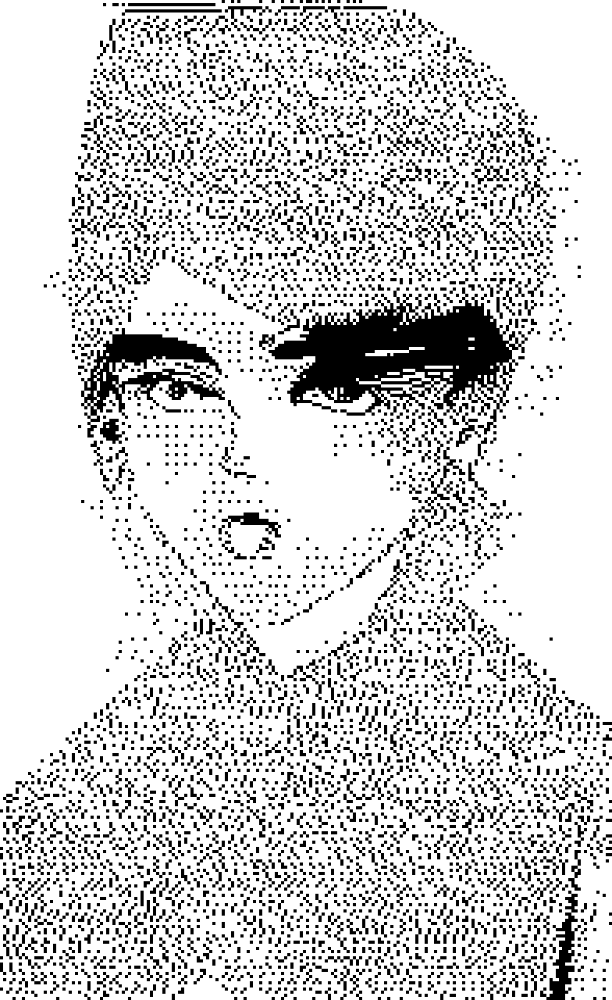
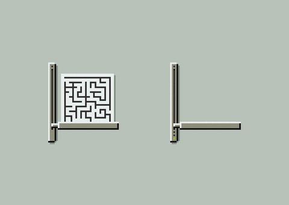

<!-- ================================================================= -->
<!-- GREETING & TYPING TAGLINE                                         -->
<!-- ================================================================= -->
<h1 align="center">Hi, I'm Dishu</h1>

  

<!-- ================================================================= -->
<!-- SECTION 03: SOCIALS                                               -->
<!-- ================================================================= -->

  
  &nbsp;
  

 

<!-- ================================================================= -->
<!-- SECTION 04: ABOUT ME                                              -->
<!-- ================================================================= -->
<table border="0" cellpadding="0" cellspacing="0" width="100%">
  <tr>
    <td valign="top" width="62%">
      <h3> &nbsp;About!</h3>
      <ul>
        <li><b>Academic:</b> Delhi University &bull; Class of 2027</li>
        <li><b>Base:</b> Jaipur, India</li>
        <li><b>Objective:</b> Building systems, competitive hackathons</li>
        <li><b>Environment:</b> macOS / VS Code / Terminal</li>
        <li><b>Audio Feed:</b> Spotify (on repeat)</li>
        <li><b>Offline:</b> Gaming / Binging</li>
        <li><b>Languages:</b> English, Hindi, French</li>
      </ul>
    </td>
    <td align="right" valign="top" width="38%">
      
    </td>
  </tr>
</table>

 

<!-- ================================================================= -->
<!-- SECTION 05: GITHUB STATS                                          -->
<!-- ================================================================= -->

  
  &nbsp;
  

 

<!-- ================================================================= -->
<!-- SECTION 06: LANGUAGES, FRAMEWORKS & TOOLS                         -->
<!-- ================================================================= -->

  

 

<!-- ================================================================= -->
<!-- SECTION 07: CONTRIBUTION GRAPH                                    -->
<!-- ================================================================= -->

  

 

<!-- ================================================================= -->
<!-- SECTION 08 & 09: SCAN ACCENT, VISITOR COUNTER & FOOTER            -->
<!-- ================================================================= -->

  
   
  <code>// DISHU DHALWAL &bull; SYSTEM RUNTIME ACTIVE &bull; 2026 //</code>

  

